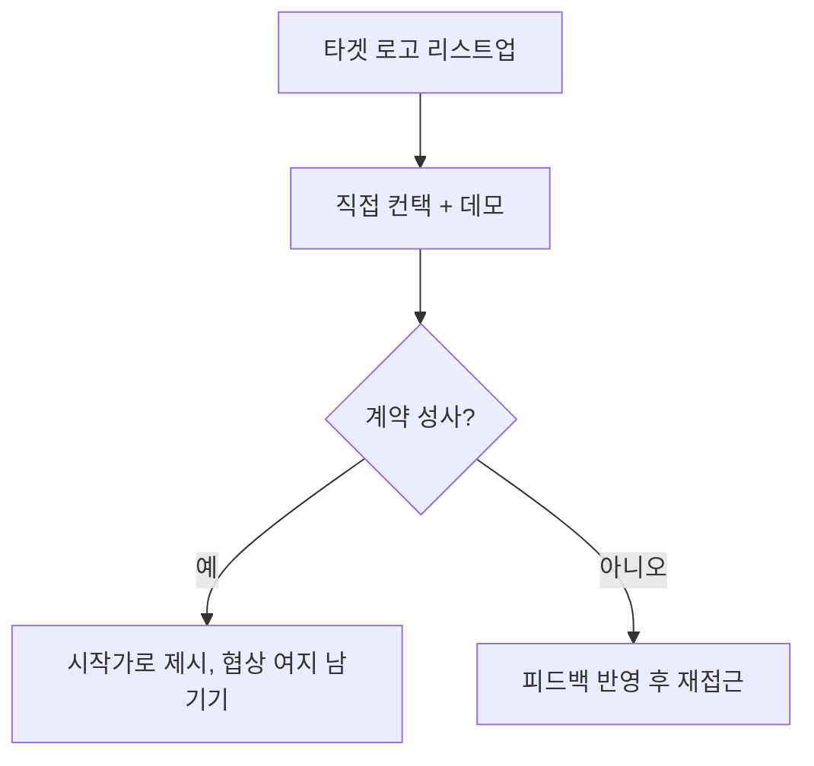

[샘플 데이터] 이 페이지는 web/ 개발용 예시이며, 실제 검수된 조언이 아닙니다.

확장 가능한 채널을 먼저 찾으려는 시도는 초기에는 시간 낭비가 되기 쉽다. 첫 사용자는 결국 한 명씩 직접
설득해서 데려와야 한다 {{advice:paul-graham-sample-do-things-that-dont-scale--01}}.

이름값 있는 고객 1~2곳은 매출보다 신뢰 신호가 더 크다. 파격적인 조건을 줘서라도 먼저 확보하는 편이 낫다
{{advice:lightcone-sample-enterprise-first-customers--01}}.

첫 엔터프라이즈 가격은 협상의 시작가일 뿐, 최종가라고 생각하지 않아도 된다
{{advice:lightcone-sample-enterprise-first-customers--02}}.

첫 고객을 어떻게 확보하느냐는 이후 [[pricing-strategy]]와 [[unit-economics]]에도 그대로 이어진다.

