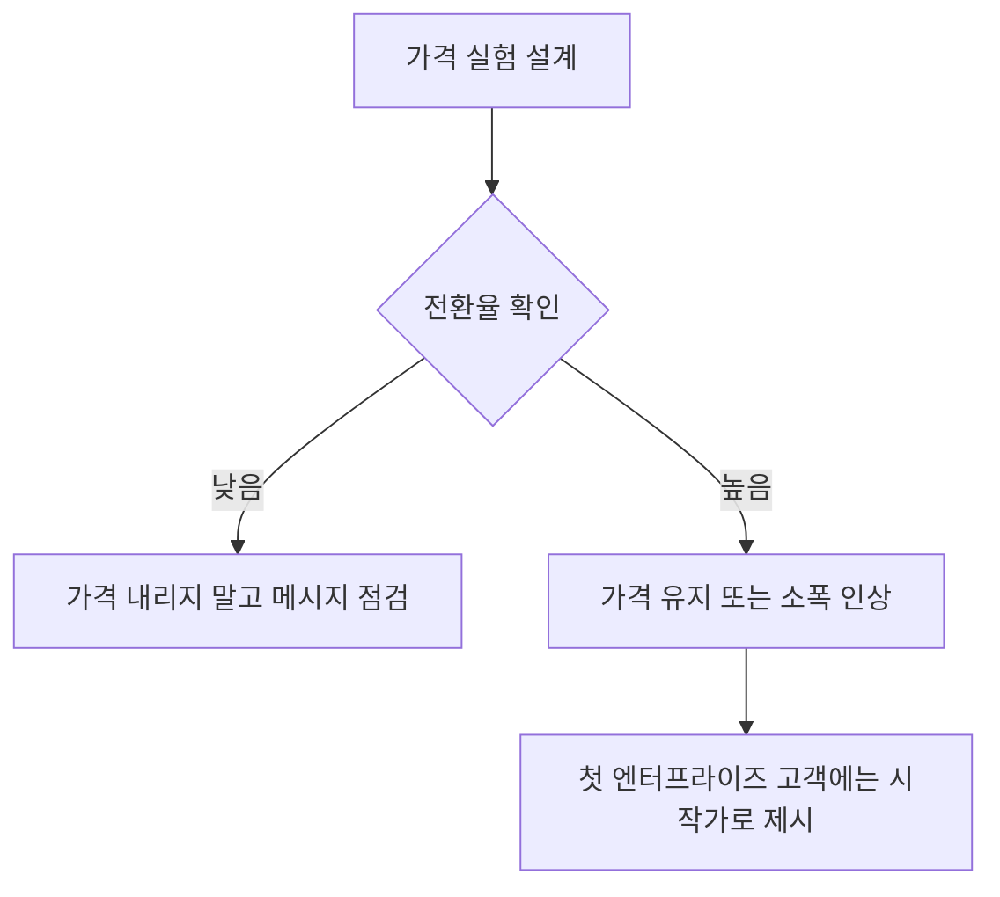

[샘플 데이터] 이 페이지는 web/ 개발용 예시이며, 실제 검수된 조언이 아닙니다.

가격은 한 번 정하면 되돌리기 어렵다. 그래서 초기에는 가격표를 공개하기 전에 몇 명과 직접 협상하며
반응을 재보는 쪽이 안전하다 {{advice:paul-graham-sample-do-things-that-dont-scale--02}}.

B2B 제품은 가치를 충분히 증명하기 전에 가격을 낮추면 나중에 올리기가 훨씬 어려워진다.
그래서 초기에는 오히려 가격을 높게 시작하는 쪽을 권한다 {{advice:yc-youtube-sample-pricing-lesson--01}}.

가격을 바꿀 때는 매출 총액이 아니라 전환율을 봐야 한다 {{advice:yc-youtube-sample-pricing-lesson--02}}.
엔터프라이즈 고객에게 제시하는 첫 가격은 최종가가 아니라 협상의 시작가로 여기면 된다
{{advice:lightcone-sample-enterprise-first-customers--02}}.

가격 결정은 결국 [[unit-economics]]와 [[first-customers]] 확보 전략과 맞물려 있다.

