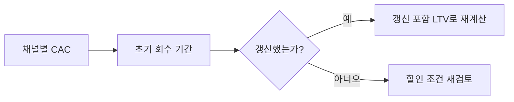

[샘플 데이터] 이 페이지는 web/ 개발용 예시이며, 실제 검수된 조언이 아닙니다. AI가 초안을 만들었고 아직 사람이 검수하지 않았습니다.

가격 실험을 할 때는 매출이 아니라 전환율로 판단해야 한다 {{advice:yc-youtube-sample-pricing-lesson--02}}.
시리즈 A 이후에는 채널별 CAC 회수 기간을 분기마다 다시 계산해봐야 한다
{{advice:yc-youtube-sample-pricing-lesson--03}}.

엔터프라이즈 딜은 첫 계약만 보면 늘 손해처럼 보이지만, 갱신율까지 포함해서 다시 계산해야 진짜 그림이 보인다
{{advice:lightcone-sample-enterprise-first-customers--03}}.

결국 unit economics는 [[pricing-strategy]]와 [[first-customers]] 확보 방식에 따라 크게 달라진다.

